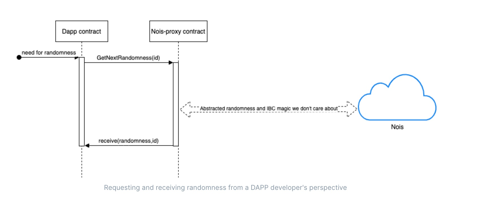

# Use Nois Randomness Beacon - For DAPP Developers

Good to know:

> ℹ️ This section is intended for developers who are building applications that
> consume the randomness. If you are looking on the documentation to contribute
> to Nois then check The Nois Developement section (Under construction).

​ From a DAPP developer's perspective, getting randomness is as simple as 2
handlers in the contract. The first handler is **GetNextRandomness(job_id)** and
the second handler is **receive(randomness,job_id)** **job_id:** This is an
internal identifier within the dapp to know what the randomness is going to be
used for. Imagine you have multiple players, and each one of them is rolling the
dice. when player Bob rolls the dice, your DAPP chooses a **job_id** of type
string to reference the randomness that will hold the randomness of the dice
roll of Bob. In another use case you can have on the same contract rounds of
lottery A and rounds of lottery B. You can set one **job_id** per lottery so
that the contract knows what randomness matches what game.

> ℹ️ You can choose whichever string you like for the **job_id**. The **job_id**
> is not about routing the randomness back to your contract. The routing
> callback will simply go to the contract that called the nois-proxy.

**randomness**: This is the raw randomness hexadecimal data. Example of
randomness:

```
ba17f71e631b9c3f6ad32ab44f6031ef885f2c3021c58edaa853b539f0225ea3
```


